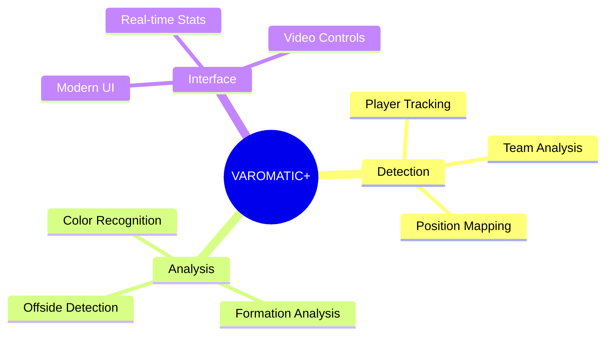
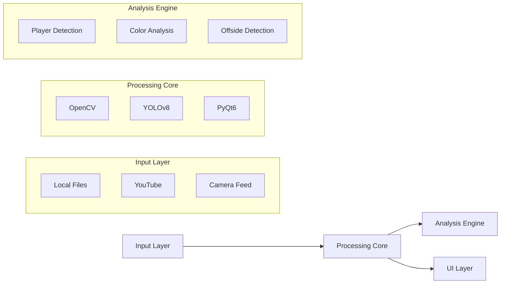
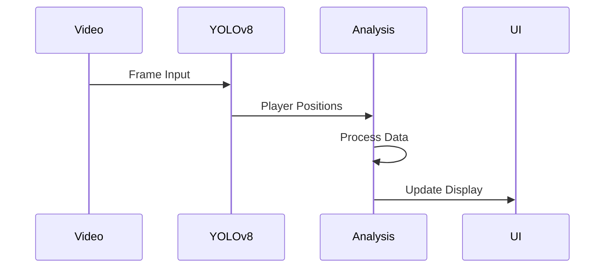
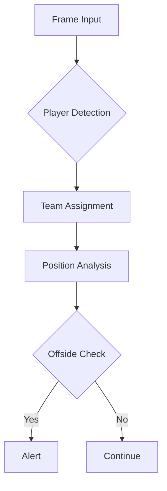
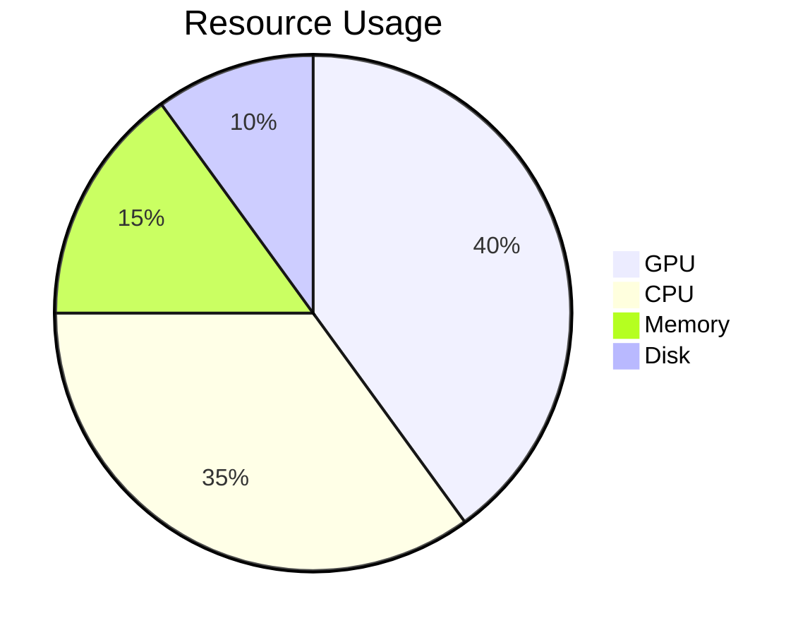
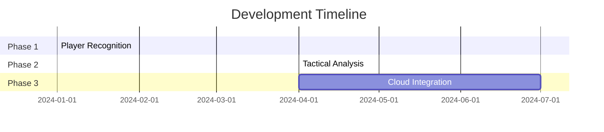

# VAROMATIC+
## Next-Generation Football Analysis System


---

### Executive Summary



---

### 🎯 Core Capabilities

| Feature | Description | Technology |
|---------|-------------|------------|
| Player Detection | Real-time tracking | YOLOv8 Neural Network |
| Offside Analysis | Automated line detection | Computer Vision + AI |
| Team Recognition | Jersey color analysis | Color Clustering |
| Video Processing | Multi-source support | OpenCV + PyQt6 |

---

### 🔬 Technical Stack



---

### 🎮 User Interface


#### Key Features
- Dark Mode Professional Design
- Real-time Analytics Display
- Intuitive Video Controls
- Multi-source Input Support
- Performance Metrics

---

### 🧠 AI-Powered Detection



**Performance Metrics:**
- 30 FPS Processing
- 95% Detection Accuracy
- Real-time Analysis
- GPU Acceleration

---

### 🎨 Color Analysis System

**Advanced Algorithm Pipeline:**
```python
def analyze_team_colors(frame, player_boxes):
    # Extract jersey colors
    colors = extract_dominant_colors(frame, boxes)
    
    # Cluster into teams
    team1, team2 = cluster_team_colors(colors)
    
    # Assign players
    assignments = assign_team_players(boxes, team1, team2)
    
    return team1, team2, assignments
```

---

### 📊 Real-time Analytics

| Metric | Value | Description |
|--------|-------|-------------|
| FPS | 25-30 | Frames processed per second |
| Detection Rate | 95% | Player detection accuracy |
| Processing Time | 33ms | Per frame processing |
| Memory Usage | 2-4GB | Runtime memory footprint |

---

### 🔍 Offside Detection



**Key Components:**
- Dynamic Line Detection
- Position Tracking
- Real-time Validation
- Instant Alerts

---

### 💾 Data Processing

**Supported Formats:**
- 📹 Video: MP4, AVI, MKV
- 🌐 Streaming: YouTube
- 📸 Camera: Live Feed

**Output:**
- 📊 JSON Analytics

- 🎥 Analyzed Video
- 📈 Performance Data
- 📑 Match Reports

---

### 🚀 Performance Features



- CUDA/MPS Acceleration
- Multi-threading Support
- Memory Optimization
- Efficient I/O Handling

---

### 🔮 Future Roadmap



---

### 🌟 Why VAROMATIC+?

1. **Innovation**
   - Cutting-edge AI technology
   - Real-time processing
   - Advanced analytics

2. **Reliability**
   - High accuracy
   - Robust performance
   - Professional support

3. **Scalability**
   - Cloud-ready
   - API integration
   - Extensible platform

---

### 📱 Contact & Support

**VAROMATIC+ Professional**
*Revolutionizing Football Analysis*

- 🌐 Website: [www.varomatic.pro]
- 📧 Email: [support@varomatic.pro]
- 🐦 Twitter: [@varomaticpro]

---

### Thank You


**VAROMATIC+ Professional**
*The Future of Football Analysis* 